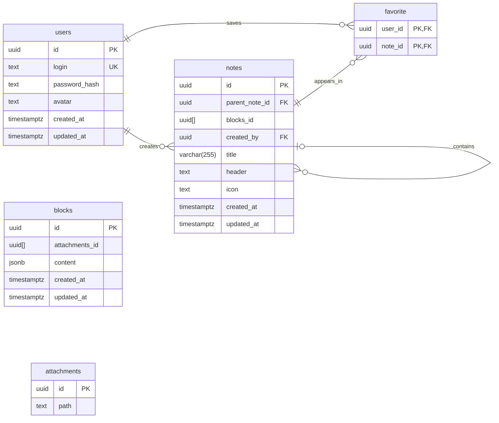

# 2026_2_BNN

Учебный backend аналога Notion от команды BNN 🪲

Go, Gorilla Mux, JWT и Argon2id. Пока данные хранятся в памяти.

## Структура проекта

```text
build/             — Dockerfile и файлы сборки
cmd/main/          — запуск сервера и роутинг
internal/models/   — модели данных
internal/pkg/auth/ — регистрация, вход и авторизация
internal/pkg/note/ — получение заметок
static/            — статические файлы
postman/           — коллекция запросов
```

## Запуск

Версия Go в проекте — `1.26.3`.

Из корня проекта:

```bash
go mod download
export JWT_SECRET="$(openssl rand -hex 32)"
go run ./cmd/main
```

Сервер доступен по адресу `http://localhost:5458`.

`JWT_SECRET` используется для подписи токенов. Команда выше создаёт случайный ключ для локального запуска. При смене ключа ранее выданные токены перестанут проходить проверку.

## API

| Метод | Путь | Назначение | Авторизация |
|---|---|---|---|
| POST | `/api/auth/signup` | Регистрация | Нет |
| POST | `/api/auth/signin` | Вход | Нет |
| GET | `/api/notes/getall` | Список заметок | Да |
| GET | `/api/notes/{id}` | Одна заметка | Да |

Для регистрации и входа передаётся JSON:

```json
{
  "login": "testuser",
  "password": "password123"
}
```

При регистрации логин должен содержать **3–20 рун**, пароль — **8–128 рун**. Лимит тела запросов регистрации и входа — **4096 байт**.

Регистрация возвращает `201`, вход — `200`. В ответе приходит пользователь без пароля и хеша.

Авторизация работает через HttpOnly-cookie `bnn_jwt` со сроком действия 12 часов. Для запросов с фронтенда используется `credentials: "include"`.

### Пагинация

```text
GET /api/notes/getall?limit=10&offset=0
```

- `limit` — от 1 до 100, по умолчанию 10.
- `offset` — целое число от 0, по умолчанию 0.
- Ответ — массив заметок; если записей нет, возвращается `[]`.

Основные статусы ошибок: `400`, `401`, `403`, `404`, `409`, `413`, `500`. Фронтенд должен ориентироваться на статус: единый JSON-формат ошибок пока не введён.

## Проверка

```bash
go build ./...
go test ./...
```

Покрытие тестами:

```bash
go test ./... -coverprofile=coverage.out
go tool cover -func=coverage.out
```

Коллекция запросов находится в `postman/`. Для проверки нужно запустить сервер и импортировать коллекцию в Postman. Если в сохранённом запросе списка указан `/api/notes`, заменить его на `/api/notes/getall`.

## Текущий этап

- База данных ещё не подключена; пользователи исчезают после перезапуска.
- Заметки представлены тестовыми данными, их UUID меняются при запуске.
- Список пока общий, а получение одной заметки проверяет владельца. Поэтому заметка из списка может возвращать `403`.
- CORS, ручка профиля и обновление модели заметки находятся в работе.
- Docker-конфигурация требует доработки.

## Планируемая схема базы данных

Схема описывает проектируемую БД. Не все сущности пока реализованы в коде.

