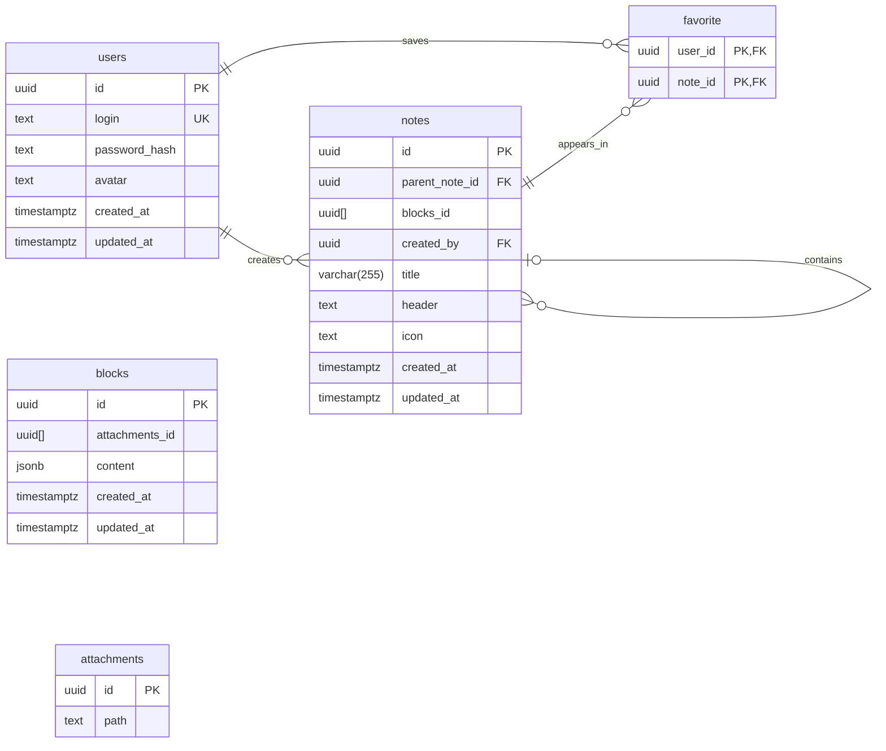

# 2026_2_BNN

Учебный backend аналога Notion от команды BNN.

Проект написан на Go. Реализованы регистрация, вход и получение заметок.

## Структура проекта

```text
build/             — файлы для сборки Docker
cmd/main/          — запуск сервера и маршруты
internal/models/   — структуры данных
internal/pkg/auth/ — регистрация и авторизация
internal/pkg/note/ — работа с заметками
static/            — изображения и другие файлы
postman/           — запросы для проверки API
```

## Запуск

Нужен Go версии 1.26.3 или новее.

Из корня проекта:

```bash
go mod download
export JWT_SECRET="$(openssl rand -hex 32)"
go run ./cmd/main
```

`JWT_SECRET` — секретный ключ для подписи токенов. Команда выше создаёт его для локального запуска.

Адрес сервера: `http://localhost:5458`.

## API

| Метод | Адрес | Описание |
|---|---|---|
| POST | `/api/auth/signup` | Регистрация |
| POST | `/api/auth/signin` | Вход |
| GET | `/api/notes/getall` | Список заметок |
| GET | `/api/notes/{id}` | Получение заметки по ID |

### Регистрация и вход

Отправлять JSON:

```json
{
  "login": "testuser",
  "password": "password123"
}
```

При регистрации:

- Логин — от **3 до 20 символов**, должен быть уникальным.
- Пароль — от **8 до 128 символов**.

Размер запроса регистрации и входа — не больше **4096 байт**.

После регистрации или входа сервер возвращает данные пользователя и устанавливает cookie `bnn_jwt` на 12 часов. Пароль и его хеш в ответ не попадают.

Для получения заметок нужна авторизация. Во фронтенде при запросах нужно указывать `credentials: "include"`.

### Список заметок

```text
/api/notes/getall?limit=10&offset=0
```

- `limit` — сколько заметок получить: от 1 до 100, по умолчанию 10.
- `offset` — сколько заметок пропустить: от 0, по умолчанию 0.

Ответ — массив заметок. Если заметок нет, возвращается `[]`.


## Проверка

```bash
go build ./...
go test ./...
```

Запросы для ручной проверки находятся в папке `postman/`. Запустите сервер и импортируйте коллекцию в Postman. Адрес списка заметок — `/api/notes/getall`.

## Что пока не готово

- База данных не подключена. Пользователи хранятся в памяти и исчезают после перезапуска.
- Заметки пока тестовые. Их ID меняются после перезапуска.
- Список возвращает общие заметки, а получение по ID проверяет владельца. Эта логика ещё дорабатывается.
- CORS, ручка профиля и Docker-конфигурация ещё в работе.

## Планируемая схема БД

