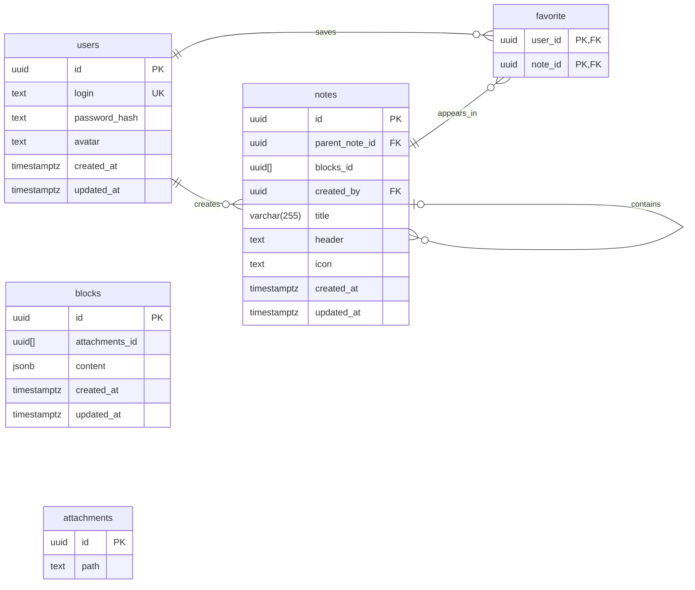

# 2026_2_BNN

Учебный backend аналога Notion от команды BNN.

Проект написан на Go. Реализованы регистрация, вход и получение заметок.

## Структура проекта

```text
build/             — файлы для сборки Docker
cmd/main/          — запуск сервера и маршруты
internal/models/   — структуры данных
internal/pkg/auth/ — регистрация и авторизация
internal/pkg/note/ — работа с заметками
internal/pkg/users/ — профиль пользователя
static/            — изображения и другие файлы
postman/           — запросы для проверки API
.env.example       — шаблон `.env`
```

Внутри `internal/pkg/auth/`:

- `handlers.go` — HTTP-хендлеры `SignUp`, `SignIn`, `Middleware`.
- `service.go` — генерация и парсинг JWT, установка куки.
- `handlers_test.go` — тесты.

## Запуск

Нужен Go версии 1.26.3 или новее.

### 1. Склонировать и скачать зависимости

```bash
git clone https://github.com/go-park-mail-ru/2026_2_BNN.git
cd 2026_2_BNN
go mod download
```

### 2. Создать `.env`

Скопируй шаблон и сгенерируй секрет:

```bash
cp .env.example .env
openssl rand -hex 32
```

Вставь полученную строку в `.env`:

```env
JWT_SECRET=<вставь_сюда_сгенерированную_строку>
```

`JWT_SECRET` — секретный ключ для подписи токенов. Он не должен попадать в Git.

### 3. Запустить

```bash
go run ./cmd/main
```

Если `.env` нет — можно задать секрет через переменную окружения:

```bash
export JWT_SECRET="$(openssl rand -hex 32)"
go run ./cmd/main
```

### Альтернатива: запуск через Docker

```bash
docker compose up --build
```

Адрес сервера: `http://localhost:5458`.

## API

| Метод | Адрес | Описание |
|---|---|---|
| POST | `/api/auth/signup` | Регистрация |
| POST | `/api/auth/signin` | Вход |
| GET | `/api/notes/getall` | Список заметок |
| GET | `/api/notes/{id}` | Получение заметки по ID |
| GET | `/api/users/me` | Профиль текущего пользователя |

### Регистрация

`POST /api/auth/signup`

```json
{
  "login": "testuser",
  "password": "password123"
}
```

При регистрации:

- Логин — от **3 до 20 символов**, должен быть уникальным.
- Пароль — от **8 до 128 символов**.

Размер запроса регистрации и входа — не больше **4096 байт**.

После регистрации или входа сервер возвращает данные пользователя и устанавливает cookie `bnn_jwt` на 48 часов. Пароль и его хеш в ответ не попадают.

Для получения заметок нужна авторизация. Во фронтенде при запросах нужно указывать `credentials: "include"`.

Ответ: `201 Created`, JSON с данными пользователя, `Set-Cookie: bnn_jwt=...`.

### Вход

`POST /api/auth/signin`

```json
{
  "login": "testuser",
  "password": "password123"
}
```

Ответ: `200 OK`, JSON с данными пользователя, новая кука `bnn_jwt`.

Ошибки:

- `400 Bad Request` — некорректный JSON.
- `401 Unauthorized` — неверный логин или пароль.

### Список заметок

`GET /api/notes/getall?limit=10&offset=0`

```text
/api/notes/getall?limit=10&offset=0
```

- `limit` — сколько заметок получить: от 1 до 100, по умолчанию 10.
- `offset` — сколько заметок пропустить: от 0, по умолчанию 0.

Ответ — массив заметок. Если заметок нет, возвращается `[]`.

### Одна заметка

`GET /api/notes/{id}`

- `{id}` — UUID заметки.

Ответ:

- `200 OK` — заметка найдена и принадлежит текущему пользователю.
- `400 Bad Request` — ID не является валидным UUID.
- `403 Forbidden` — заметка принадлежит другому пользователю.
- `404 Not Found` — заметки с таким ID нет.

### Профиль пользователя

`GET /api/users/me`

Возвращает данные текущего авторизованного пользователя (по куке).

Ответ: `200 OK`, JSON с полями `id`, `login`, `avatar`, `version`, `created_at`, `updated_at`.

## Аутентификация

JWT-токен устанавливается в HttpOnly-куку `bnn_jwt` со сроком жизни **48 часов**.

- Кука `HttpOnly` — JavaScript на клиенте её не видит.
- Флаг `SameSite=Lax` — защита от CSRF.
- `Secure: false` в dev, на проде с HTTPS — нужно ставить `true`.

Содержимое токена (claims):

- `user_id` — UUID пользователя.
- `version` — версия пользователя (для инвалидации старых токенов).
- `iat`, `nbf`, `exp` — метки времени в UTC.

При смене пароля или других критичных изменениях можно увеличить `user.Version` — все старые токены автоматически станут невалидными.

Во фронтенде для запросов с кукой нужно указывать `credentials: "include"`.

## Проверка

```bash
go build ./...
go test ./...
go vet ./...
```

Запросы для ручной проверки находятся в папке `postman/`. Запустите сервер и импортируйте коллекцию в Postman. Адрес списка заметок — `/api/notes/getall`.

## Что пока не готово

- База данных не подключена. Пользователи хранятся в памяти и исчезают после перезапуска.
- Заметки пока тестовые. Их ID меняются после перезапуска.
- Список возвращает общие заметки, а получение по ID проверяет владельца. Эта логика ещё дорабатывается.
- CORS, Refresh-токен ещё в работе.

## Планируемая схема БД


```mermaid
erDiagram
    direction LR

    users {
        uuid id PK
        text login UK
        text password_hash
        text avatar
        timestamptz created_at
        timestamptz updated_at
    }

    notes {
        uuid id PK
        uuid parent_note_id FK
        uuid[] blocks_id
        uuid created_by FK
        varchar(255) title
        text header
        text icon
        timestamptz created_at
        timestamptz updated_at
    }

    favorite {
        uuid user_id PK, FK
        uuid note_id PK, FK
    }

    blocks {
        uuid id PK
        uuid[] attachments_id
        jsonb content
        timestamptz created_at
        timestamptz updated_at
    }

    attachments {
        uuid id PK
        text path
    }

    users ||--o{ notes : creates
    notes o|--o{ notes : contains
    users ||--o{ favorite : saves
    notes ||--o{ favorite : appears_in
```
