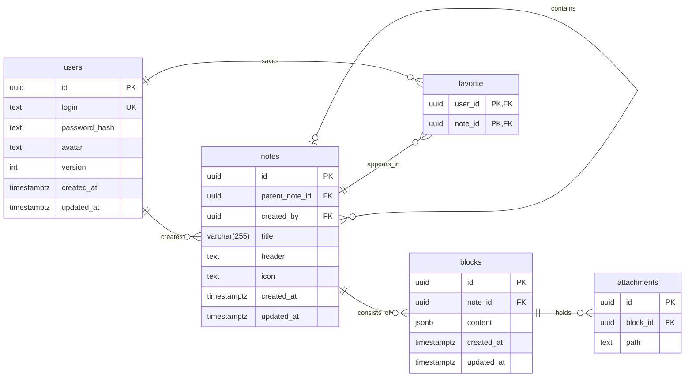

# 2026_2_BNN

Backend аналога Notion. Команда BNN.

Развёрнут: **https://brandnewnotes.ru**

## Структура

```text
build/             Dockerfile
cmd/main/          точка входа, роутинг
internal/models/   структуры данных
internal/pkg/      auth, note, user, middleware
postman/           коллекция запросов
nginx.conf         конфиг nginx 
```

## Запуск

Нужен Go 1.26.5 или новее.

```bash
git clone https://github.com/go-park-mail-ru/2026_2_BNN.git
cd 2026_2_BNN
cp .env.example .env
```

В `.env` указать два значения:

| Переменная | Что это |
|---|---|
| `JWT_SECRET` | Ключ подписи токенов. Сгенерировать: `openssl rand -hex 32` |
| `FRONTEND_ORIGIN` | Адрес фронтенда для CORS|

Без них приложение не запустится.

```bash
go run ./cmd/main
```

через Docker:

```bash
docker compose up --build
```

Адрес: `http://localhost:5458`

## API

| Метод | Путь | Описание |
|---|---|---|
| POST | `/api/auth/signup` | Регистрация |
| POST | `/api/auth/signin` | Вход |
| GET | `/api/users/me` | Профиль текущего пользователя |
| GET | `/api/notes/getall` | Список заметок, параметры `limit` и `offset` |
| GET | `/api/notes/{id}` | Заметка по UUID |

Примеры запросов и ответов — в коллекции `postman/BNN.postman_collection.json`.

Ограничения: логин 3–20 символов и уникален, пароль 8–128 символов, тело запроса до 4096 байт. `limit` 1–100 (по умолчанию 10), `offset` от 0.

У ошибок нет тела — только HTTP-код. Пустой список приходит как `[]`, не `null`.


## Проверка

```bash
go build ./... && go vet ./... && go test -race -cover ./...
```


## Cхема БД


```mermaid
erDiagram
    direction LR

    users {
        uuid id PK
        text login UK
        text password_hash
        text avatar
        int version
        timestamptz created_at
        timestamptz updated_at
    }

    notes {
        uuid id PK
        uuid parent_note_id FK
        uuid created_by FK
        varchar(255) title
        text header
        text icon
        timestamptz created_at
        timestamptz updated_at
    }

    blocks {
        uuid id PK
        uuid note_id FK
        jsonb content
        timestamptz created_at
        timestamptz updated_at
    }

    attachments {
        uuid id PK
        uuid block_id FK
        text path
    }

    favorite {
        uuid user_id PK, FK
        uuid note_id PK, FK
    }

    users ||--o{ notes : creates
    notes o|--o{ notes : contains
    notes ||--o{ blocks : consists_of
    blocks ||--o{ attachments : holds
    users ||--o{ favorite : saves
    notes ||--o{ favorite : appears_in
```
