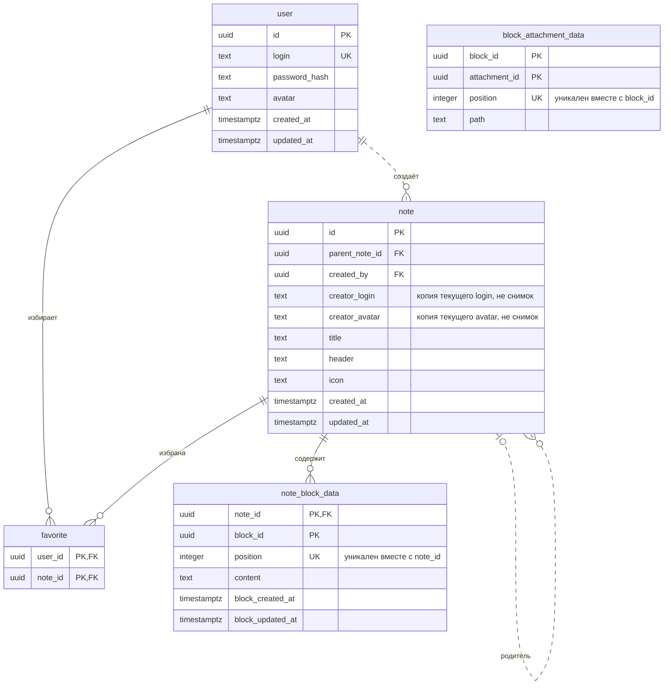

# 1 Нормальная форма

Блок может использоваться в нескольких заметках; вложение — в нескольких блоках.
Внутри одного родителя элемент встречается один раз; position хранит его порядок.
content — единое значение редактора, без самостоятельных сущностей/связей внутри.
login уникален и обязателен; иных функциональных зависимостей не предполагается.

На этом этапе нет таблицы `block`, поэтому у `block_attachment_data` нет внешнего ключа: `block_id` в `note_block_data` не уникален, на него нельзя сослаться.

