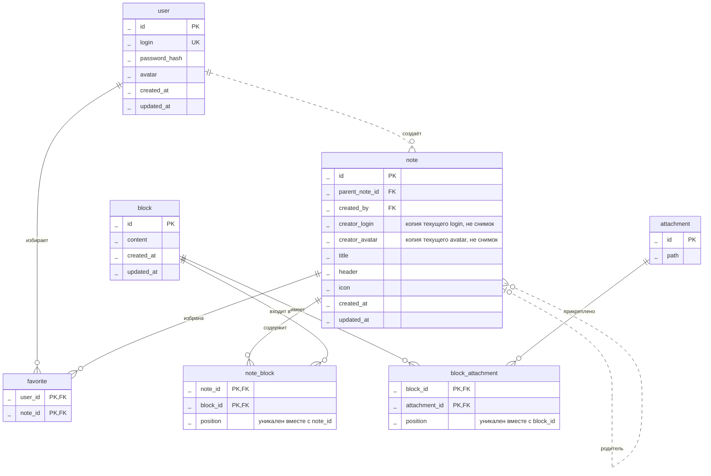

# 2 Нормальная форма

Блок может использоваться в нескольких заметках; вложение — в нескольких блоках.
Внутри одного родителя элемент встречается один раз; position хранит его порядок.
content — единое значение редактора, без самостоятельных сущностей/связей внутри.
login уникален и обязателен; иных функциональных зависимостей не предполагается.

Для 2НФ данные блока и вложения вынесены в `block` и `attachment`. В таблицах связей остаются только ключи и `position`.
Частичных зависимостей от составного ключа больше нет. В `note` ещё лежат `creator_login` и `creator_avatar` — это уже нарушение 3НФ, не 2НФ.

`_` перед именем атрибута — не тип данных. Без этого слова mermaid не рисует атрибут: строка `id PK` для него синтаксическая ошибка.

