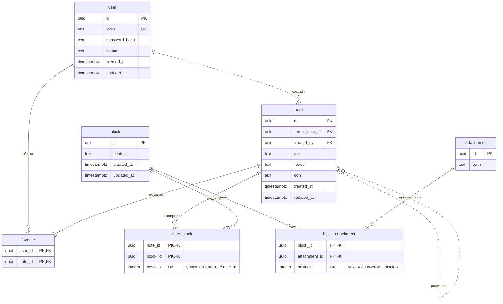

# 3 Нормальная форма и НФБК

Блок может использоваться в нескольких заметках; вложение — в нескольких блоках.
Внутри одного родителя элемент встречается один раз; position хранит его порядок.
content — единое значение редактора, без самостоятельных сущностей/связей внутри.
login уникален и обязателен; иных функциональных зависимостей не предполагается.

Для 3НФ из `note` убраны `creator_login` и `creator_avatar`. Они зависят от пользователя, а не от самой заметки, и уже есть в `user`.

P.S.
Почему у нас получились 3НФ и НФБК в одной схеме. НФБК строже 3НФ: левая часть каждой зависимости должна быть ключом. Разница появляется, только если часть ключа зависит от атрибута, который сам ключом не является. После выноса данных автора таких зависимостей нет: всё определяется ключами таблиц. Поэтому отдельно дробить схему для НФБК не является нужным.

